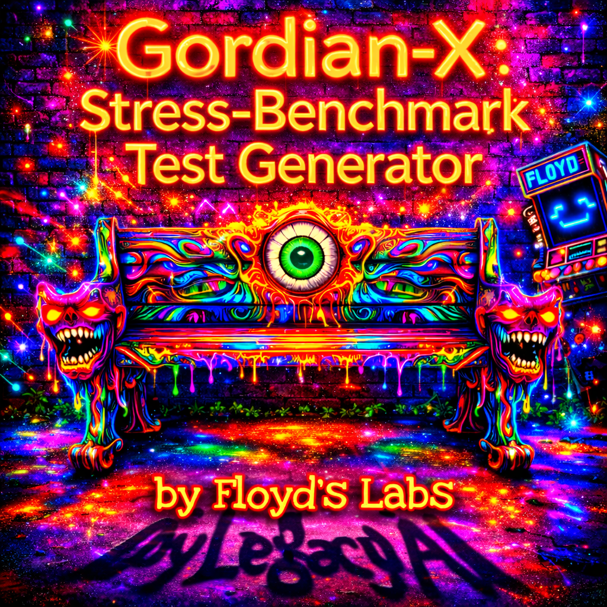

# Gordian-X: Adversarial Synthesis Engine

Ultra-high-complexity evaluation benchmark generator for stress-testing Large Language Models. Built by Floyd's Labs.

## Features

- **Attack Vector Matrix** -- Five cognitive attack vectors: Recursive Invalidation, High-Dim CSP, Counterfactual Logic, Semantic Camouflage, N-th Order Theory of Mind
- **Entropy-Responsive Theming** -- UI shifts gold to green to magenta as entropy increases
- **OpenAI Integration** -- Real adversarial benchmark generation via GPT-4o with streaming output
- **Engine Consultant Chat** -- Conversational interface with the full Gordian-X adversarial persona
- **Command Palette** -- Ctrl+K quick access to all engine controls
- **Smoked Glass Aesthetic** -- Glassmorphic panels over a fixed psychedelic backdrop

## Usage

Open `index.html` in any browser. No build tools or dependencies required.

For live benchmark generation, open Settings (gear icon) and enter an OpenAI API key.
